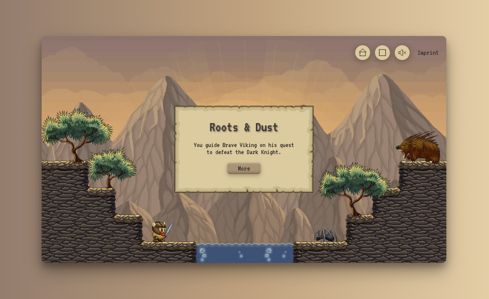
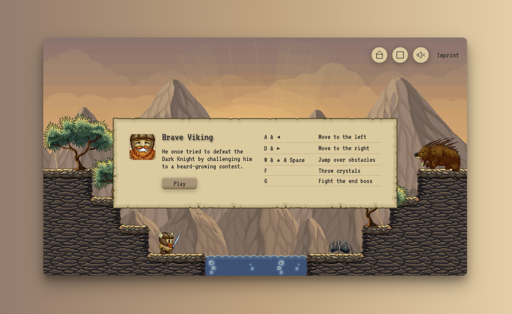
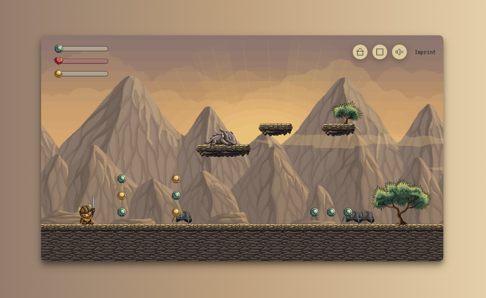
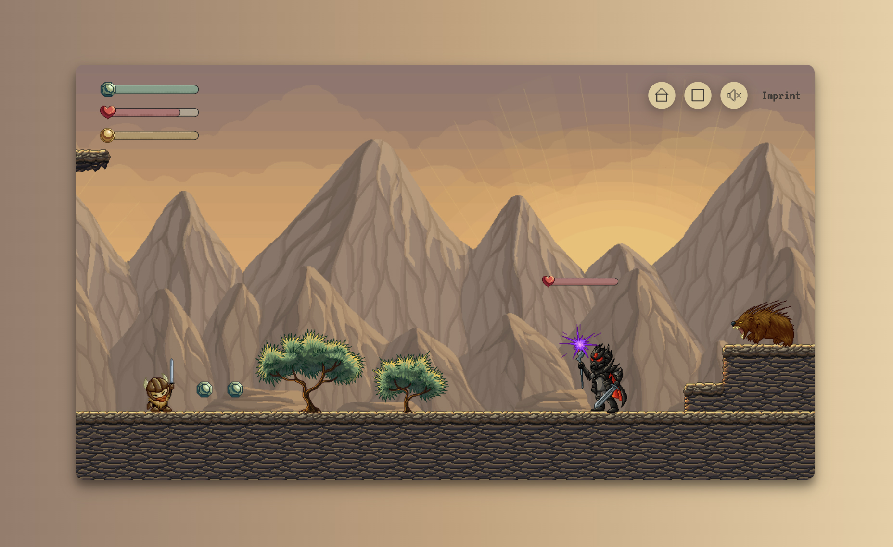

<h1 align="left">Roots & Dust</h1>

###

The platformer “Roots & Dust” was developed using JavaScript and object-oriented programming. The goal was to build a custom level and implement various background graphics, enemies, and difficulty levels within it. The graphics I used are from <a href="https://craftpix.net/product/fantasy-platformer-game-kit-pixel-art/" target="blank">CraftPix</a>. I adjusted them for my own creative purposes. 

This platformer is part of the Developer Akademie's training programme for software developers (www.developerakademie.com). 
  

[Live View](https://platformer.karina-klages.de)

###

 

 

 

